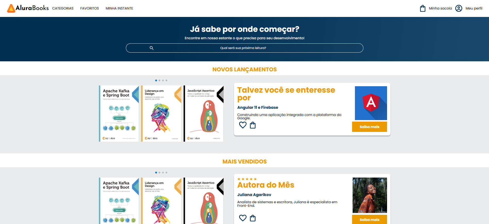

# 📚 AluraBooks

## 📌 Descrição

AluraBooks é um site de e-commerce fictício para venda de livros da plataforma Alura. O projeto apresenta uma interface responsiva com seções para novos lançamentos, livros mais vendidos, tópicos visitados recentemente e uma área para cadastro em newsletter. O design é inspirado no estilo da Alura, utilizando cores como azul e laranja.

---

## 🚀 Funcionalidades

- **Cabeçalho**: Menu de navegação com categorias (Programação, Front-end, Infraestrutura, Business, Design & UX), logo da AluraBooks, e opções para Favoritos, Minha Lista, sacola de compras e perfil do usuário.
- **Banner**: Seção de destaque com título motivacional e campo de pesquisa para encontrar livros.
- **Carrosséis**: 
  - Novos lançamentos: Exibe imagens de livros recentes usando o Swiper para navegação.
  - Mais vendidos: Similar ao anterior, focado nos livros mais populares.
- **Tópicos Visitados Recentemente**: Lista de links para tópicos populares como Android, Marketing Digital, Agile, etc.
- **Contato**: Formulário para cadastro de e-mail para receber novidades.
- **Rodapé**: Links para outras plataformas do Grupo Alura, como Casa do Código, Caelum, Alura, etc.

---

## 🛠️ Tecnologias Utilizadas

- **HTML5**: Estrutura da página.
- **CSS3**: Estilização, com variáveis CSS para cores e fontes.
- **JavaScript**: Biblioteca Swiper para os carrosséis.
- **Google Fonts**: Fontes Poppins e Josefin Sans.
- **Swiper**: Para criação de carrosséis interativos.

---

## ▶️ Como Executar

1. Clone ou baixe o repositório.
2. Abra o arquivo `index.html` em um navegador web moderno.
3. Navegue pelas seções do site.

---

## 📷 Preview



---

## 📂 Estrutura do Projeto

```
alura-books/
├── index.html          # Arquivo principal da página
├── style.css           # Arquivo CSS principal com imports
├── img/                # Pasta com imagens (logos, livros, etc.)
│   └── __MACOSX/       # Pasta do sistema (ignorar)
└── styles/             # Pasta com arquivos CSS modulares
    ├── banner.css      # Estilos do banner
    ├── carrosel.css    # Estilos dos carrosséis
    ├── contato.css     # Estilos da seção de contato
    ├── header.css      # Estilos do cabeçalho
    ├── reset.css       # Reset de estilos
    ├── rodape.css      # Estilos do rodapé
    └── topicos.css     # Estilos da seção de tópicos
```

---

## 🤝 Contribuição

Sinta-se à vontade para contribuir com melhorias. Abra uma issue ou envie um pull request.

---

## 📄 Licença

Este projeto é fictício e para fins educacionais.